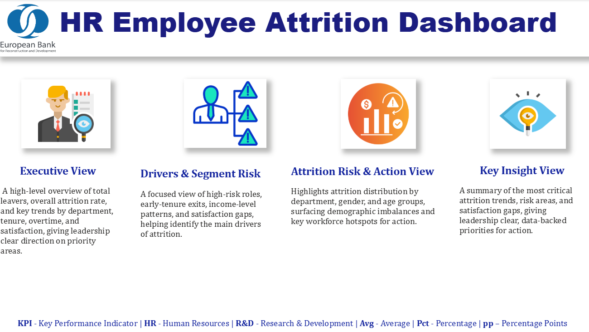
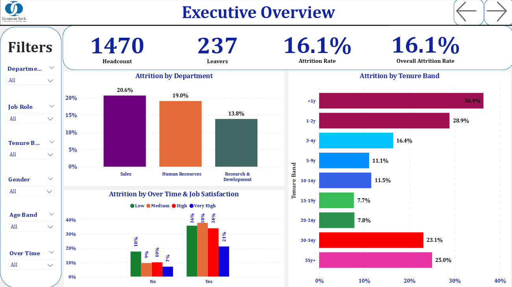
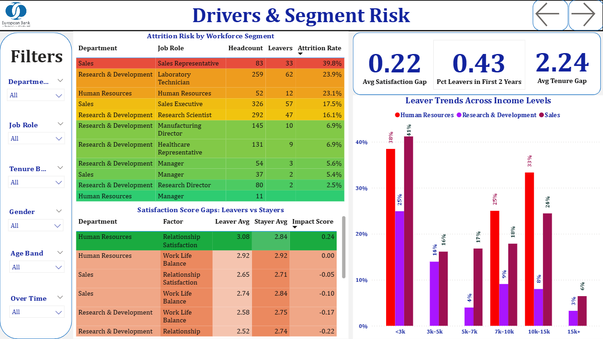
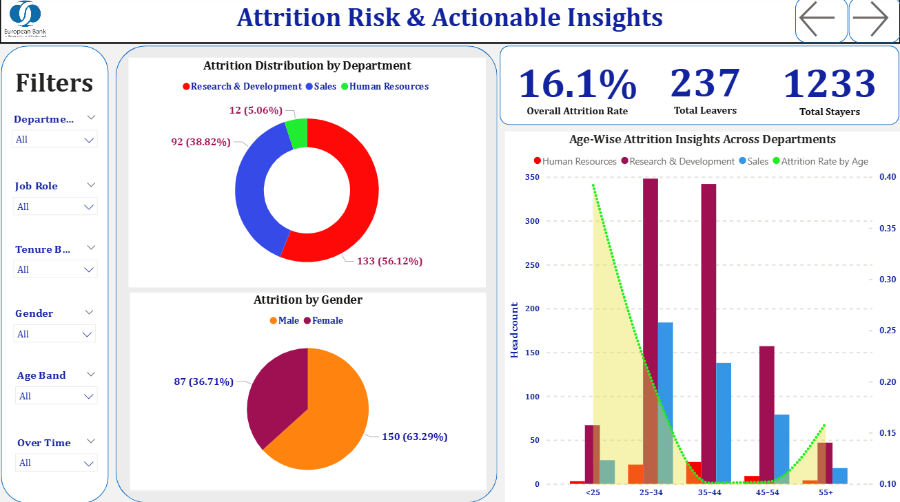

# 📊 HR Employees Attrition Dashboard

## 🎯 Project Aim
This project delivers a strategic HR Attrition Dashboard designed to provide leadership with a clear, evidence backed understanding of workforce stability and retention risk. The aim was to convert fragmented HR data into a practical decision support tool that highlights where attrition is increasing, what is driving it, and where focused action will deliver the greatest impact.

The dashboard moves beyond static HR reporting by linking workforce behaviour, engagement signals, and structural factors into a single analytical view.

## 🔗 Live Power BI Dashboard
The interactive dashboard can be accessed using the public Power BI link below:

➡️ **Power BI Dashboard (Public View)**  
[https://your-powerbi-public-link-here](https://github.com/ShivamRajput22/HR-Employees-Attrition-Dashboard/blob/main/HR%20Employee%20Attrition%20Dashboard.pbit)

## 🖼️ Dashboard Preview

### 🏠 Home Page / Executive Overview

### 📊 Executive Analysis

### 📈 Drivers and Segment Risk

### ⚠️ Attrition Risk and Action

## 🧭 Project Overview
The analysis examines attrition patterns across department level trends, job roles, tenure behaviour, age distribution, gender balance, income tiers, satisfaction metrics, and workload indicators such as overtime. Consolidating these dimensions into a single reporting environment enables leadership to identify structural risks often missed in traditional HR reporting.

The dashboard is structured into four analytical views:
- Executive Overview  
- Drivers and Segment Risk  
- Attrition Risk and Action  
- Key Insight View  

## 🚀 Value Delivered
The dashboard enables HR and senior leadership to:
- Identify high risk departments and job families before turnover becomes disruptive  
- Detect early disengagement signals using satisfaction and overtime patterns  
- Understand onboarding and early tenure vulnerabilities  
- Quantify attrition exposure across income brackets  
- Prioritise retention initiatives with the highest return  

## 🔍 Key Insights
- Overall organisational attrition stands at **16.1 percent**, concentrated within specific departments and roles  
- **Sales** and **HR** are the most exposed functions, with attrition rates of **20.6 percent** and **19.0 percent**, while **R and D** stands at **13.8 percent**  
- **Sales Representatives** are a major outlier, recording **39.8 percent attrition**  
- Early exits dominate turnover, with **36.4 percent** leaving within the first year and **28.9 percent** exiting between one and two years  
- Gender analysis shows **63.3 percent** of leavers are women compared with **36.7 percent** men  
- Attrition peaks in the **25 to 34** and **35 to 44** age groups  
- Employees working overtime face nearly double the attrition risk, even when satisfaction scores remain stable  
- Income analysis highlights two risk bands, **38 to 41 percent attrition** in the lowest income tier and **33 percent** in the 10 to 15k bracket  
- Satisfaction gaps in work life balance, relationship quality, and job clarity strongly align with exit behaviour  

## 🧠 Analytical Approach
- Cleaned and validated the dataset to ensure reliable reporting  
- Built a flexible data model supporting cross filtering by department, role, tenure, age band, income level, gender, and satisfaction  
- Designed diagnostic visuals including risk heatmaps, tenure funnels, satisfaction gap matrices, and attrition distribution charts  
- Interpreted results through a workforce behaviour and operational risk lens  

## 🛠️ Tools and Skills Used
- Power BI for data modelling, visual design, and dashboard development  
- DAX for dynamic calculations and segment level analysis  
- Workforce analytics and attrition risk modelling  
- Insight storytelling for leadership decision making  

## ✅ Outcome
The final dashboard functions as a strategic workforce intelligence tool that strengthens HR planning, exposes hidden vulnerabilities, and provides leadership with clarity on where attrition originates and how it can be addressed. It supports early intervention, stabilises critical teams, and protects the long term talent pipeline.
